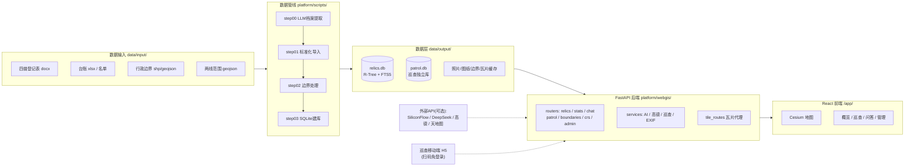

# 技术路线与架构总览

本文档面向开发者与技术评审,系统性说明文物保护利用平台的总体架构、技术选型、数据流与关键技术实现。功能介绍与使用方法见 [README.md](README.md)。

## 1. 总体思路

平台采用**单机一体化**架构:一个 Python 进程同时提供 API 服务与前端静态托管,数据全部落在本地 SQLite 与文件系统,不依赖任何外部数据库或中间件。这一选择基于文物业务的实际部署环境——基层文保单位通常只有一台普通办公电脑,要求"双击即用、断网可用、数据不出本机"。

外部依赖(大模型、高德路线、天地图底图)全部设计为**可选增强**:配了 Key 体验更好,不配则自动降级为规则引擎、直线连接、备用底图,不影响启动与核心功能。

## 2. 技术选型

| 层次 | 选型 | 理由 |
| --- | --- | --- |
| 数据管线 | Python 脚本 + OpenAI 兼容 API | 四步流水线可单独重跑;LLM 把非结构化 docx 转为结构化档案 |
| 存储 | SQLite(WAL + R-Tree + FTS5) | 零运维单文件库;空间索引与中文全文检索开箱即用 |
| 后端 | FastAPI + Uvicorn | 异步支撑瓦片代理与 SSE 流式问答;自动 API 文档 |
| 前端 | React 18 + TypeScript + Vite 5 | 组件化拆分五大功能页;构建产物直接由后端托管 |
| 地图 | Cesium 1.125 | 同一引擎覆盖 2.5D 地图与 3D Tiles 模型;瓦片走后端代理 |
| 状态管理 | Zustand 5 | 轻量切片式 store,筛选/图层/巡查各自独立 |
| 图表 | ECharts 5 | 资源概览统计图,点击联动地图筛选 |
| 3D 模型 | three + react-three-fiber + 3d-tiles-renderer | 普查三维模型(3D Tiles)独立查看页 |

## 3. 数据管线技术路线

管线位于 `platform/scripts/`,由 `run_pipeline.py` 编排,支持 `--only / --from / --to / --skip / --dry-run`,每次运行的产物校验结果写入 `data/output/logs/pipeline_manifest.json`。设计原则:**每步幂等、可单独重跑、重建不碰巡查库**。

### step00 档案提取(docx → Markdown)

- 输入 `data/input/00_docs/{乡镇}/*.docx`,输出 `data/input/01_relics/markdown/{乡镇}/*.md`。
- 直接用 `zipfile` + `ElementTree` 解析 OOXML 取正文(不依赖 python-docx),交给大模型按四普模板提取为结构化 Markdown。
- **断点续传**:产物先写 `.tmp` 再原子替换;已有 md 做完整性校验(大小 + 必要章节);进度账本 `step00_progress.json`。
- **双通道并行**:通道 A(SiliconFlow)正序、通道 B(DeepSeek 官方)倒序同时跑,`.claim` 认领锁防止重复提取,中间会合,速度约翻倍。
- **优雅停止**:检测 `data/output/logs/step00.stop` 哨兵文件退出并返回码 4,编排器据此中止后续步骤,重跑即续传。

### step01 标准化导入

- 优先解析 Markdown 档案(`md_archive.py`:全字段解析、度分秒坐标转十进制、照片/图纸清单),照片图纸按清单顺序从源 docx 内嵌图片中直接抽出;无 Markdown 时回退旧版 xlsx 台账 + `02_media` 目录。
- 两项外部数据融合:`data/*两线*/` 的测绘 GeoJSON 按名称+县区挂接为保护范围/建控地带;"市级和县级"合并级别按市保名单 xls、县保名录 xlsx 及简介公布语句拆分。
- 输出:`relics_full.json`、`relics_points.geojson`、`relics_polygons.geojson`、`photo_index.csv`、`drawing_index.csv` 及整理后的照片/图纸目录。

### step02 边界处理

- `pyshp` 读取 Shapefile,支持高斯-克吕格反算与 GCJ-02 纠偏,统一输出 WGS-84 的县/乡镇/村三级 GeoJSON;村点用射线法回填所属乡镇。

### step03 SQLite 建库

- 全量重建 `relics.db`(幂等),启用 WAL。核心结构:
  - 主表 `relics`(编号/类别/级别/坐标/县乡村/年代/状况/has_* 标志/extra_json);
  - 空间索引 `relics_rtree` + `relics_rtree_map`(R-Tree 只存整数,桥接表映射字符串 id);
  - 全文索引 `relics_fts`(FTS5 **trigram** 分词,对中文子串友好);
  - 资源表 `photos` / `drawings` / `polygons`(两线面,同 kind 允许飞地多面);
  - 运维表 `audit_log` / `stats_cache`。

## 4. 后端技术路线

后端位于 `platform/webgis/`,入口 `serve.py` 读取 `config.yaml` 启动 `uvicorn main:app`(默认 `0.0.0.0:8000`)。

### 启动生命周期(main.py lifespan)

加载配置(`${ENV}` 占位自动展开)→ 功能探测(`detect_features`,数据目录为空则自动关闭对应功能)→ 数据装载(`data_loader.store`,优先 DB 模式)→ 边界种子恢复(`services/boundary_seed.py`,清库后从 `boundary/` 自动恢复市界/县界)→ 初始化 AI/巡查/问答服务与配置热更新回调(系统管理页保存 Key 即生效,无需重启)。

### 路由分层(routers/,统一挂 /api)

| 路由 | 职责 | 代表端点 |
| --- | --- | --- |
| `relics.py` | 文物查询主链路 | `GET /api/relics/by-bbox`(视口查询)、`/search`(FTS5)、`/{code}` 详情及照片/图纸/两线/档案 |
| `stats.py` | 统计聚合 | `GET /api/stats`、`/stats/dashboard` |
| `chat.py` | AI 问答 | `POST /api/chat`(SSE 流式)、`/chat/models` |
| `patrol.py` | 巡查 PC + 移动端 | `/api/patrol/plan`(AI 规划)、`/routes`;移动端 `GET /m/r/{token}`、`/api/m/route/{token}/checkin` |
| `boundaries.py` | 边界管理 | 行政区树、在线下载、导出、清理 |
| `crs.py` | 坐标系服务 | `/api/crs/transform`(-geojson) |
| `admin.py` | 系统管理 | 管线运行/日志/停止、API 配置保存、模型列表拉取、清数 |

### 服务层(services/)

`ai_service.py` 统一 LLM 入口(文本 + 视觉);`amap_service.py` 高德驾车路径/地理编码/导航 URI;`patrol_service.py` 巡查库读写、按状况排频次、最近邻排序;`exif_gps.py` 照片 EXIF 定位提取,与文物坐标比对做到场核验。

### 瓦片代理(tile_routes.py)

`GET /tiles/{provider}/{z}/{x}/{y}` 代理天地图/高德/ArcGIS/OSM:内存 LRU + 磁盘永久缓存(`data/output/tile_cache`,同一区域只消耗一次天地图配额)、上游并发限流(Semaphore 16)、同瓦片去重飞行、天地图 Key 动态注入与子域轮转。另提供离线整片下载、进度查询、分源缓存统计与清理端点。

### 数据访问(data_loader.py)

双模式:检测到 `relics.db` 走 SQL(R-Tree 视口查询 `query_bbox`、FTS5 全文 `search_fulltext`、详情聚合 `get_relic_full`);库缺失时回退 JSON 内存模式,保证演示数据也能跑。

### 巡查独立库(patrol.db)

`patrol_routes`(路线、扫码 token、途经点、折线)与 `patrol_records`(打卡、定位核验、AI 评估结果)存放于独立 SQLite,**与主库解耦**——管线怎么重建都不丢巡查历史。

## 5. 前端技术路线

前端位于 `platform/webgis-react/`,Vite 构建 `base="/app/"`,产物由后端 `_FrontendStatic` 托管:`index.html` 每次协商不缓存,带哈希的 assets 长缓存 immutable,更新前端只需重新 build。

- **路由与页面**:HashRouter 单页应用。地图总览(`MapView` + `Toolbar` + `FilterPanel` + `InfoPanel`)、资源概览(`DashboardPage`,ECharts 点击即筛地图)、巡查(`PatrolPanel` 左规划右地图)、AI 问答(`ChatPanel`,回答中的实体可点击联动地图)、系统管理(`AdminPage`)、独立的 3D 模型页(`ModelViewerPage`)与 PDF 档案页(`PdfViewerPage`)。
- **状态管理**:Zustand 按域切片——`relicsStore`(全量数据与索引)、`filterStore`(多维筛选并映射后端参数)、`uiStore`(主题/底图/图层开关)、`patrolStore`(选点/预览/AI 方案)、`platformStore`(平台配置)等。
- **地图渲染**:双层策略——远视角按级别着色圆点,近视角切换"级别色圆底 + 类别剪影"徽章(`src/map/relicIcons.ts` 运行时合成,类别定形、级别定色);两线范围随缩放自动隐现;市界发光描边、域外压暗。
- **API 交互**:axios 统一实例(`api/client.ts`,相对路径 + `withCredentials`,401 自动跳登录),按域拆分 `api/relics|patrol|chat|admin|stats|tiles|boundaries.ts`;AI 问答走 SSE 流式渲染(marked + DOMPurify 消毒)。

## 6. AI 能力集成

所有 LLM 调用统一走 OpenAI 兼容接口,模型在系统管理页全局选择,**每处都有无 Key 降级路径**:

| 能力 | 位置 | 模型通道 | 无 Key 降级 |
| --- | --- | --- | --- |
| 档案提取(step00) | `scripts/step00_convert_docs.py` | SiliconFlow(A)/ DeepSeek(B)双通道 | 报错退出该步,不伪造数据 |
| AI 问答 | `routers/chat.py` + `services/ai_service.py` | SiliconFlow 文本模型 | 返回未配置提示 |
| 巡查意图解析 | `ai_service.parse_patrol_intent_*` | SiliconFlow 文本模型 | 正则规则解析(县区/级别/状况/数量/出发地) |
| 照片对比评估 | `ai_service.assess_patrol_photo` | 视觉模型(默认 Qwen2.5-VL-72B) | 规则兜底,沿用档案状况并标记待复评 |

问答采用"结构化台账注入"路线:后端按问题检索 top-k 文物拼入上下文,回答中的数量、县区、文物名渲染为可点击链接,点击直接驱动地图筛选/定位。

## 7. 配置与部署

- **配置单文件** `config.yaml`(模板 `config.example.yaml`):`project`(项目名)、`geo`(中心/范围/源坐标系/投影参数)、`administrative`(县区列表)、`features`(功能开关,auto 自动探测)、`patrol`(频次与核验半径)、`api`(SiliconFlow/DeepSeek/高德/天地图/Cesium Ion)、`server`(端口/对外地址/可选登录认证)。敏感 Key 支持 `${环境变量}` 占位。**换地区部署只改配置和数据,不动代码。**
- **一键启动** `start.bat`:自动选 Python(.venv > 内置 > 系统)→ 补配置 → 装依赖 → 建目录骨架 → 按需 npm build → 启动 `serve.py` 并打开浏览器;`start.bat dev` 额外起 Vite 热更新(5174 端口,代理到 8000)。
- **运行拓扑**:单机单进程,8000 端口同时服务 API、前端与瓦片;巡查移动端通过 `public_base_url`(留空自动探测局域网 IP)生成二维码,手机扫码免登录访问 H5。
- **可选认证**:`server.enable_auth` 开启后走签名会话登录,移动打卡链接始终免登录。

## 8. 质量保障

`tests/` 用 pytest 覆盖关键链路:瓦片参数解析与越界防护、登录认证与会话签名、管线产物校验与 manifest、DB 行到前端格式映射、编排器步骤选择与 dry-run。运行方式见 README「测试」一节。管线与系统管理页发起的任务日志全部落盘 `data/output/logs/`,便于事后追溯。

## 9. 演进方向

- 数据规模增长后,`by-bbox` 可引入服务端聚簇/抽稀,减轻前端点位渲染压力。
- 多人协同场景可在现有 `audit_log` 与乐观锁字段(`version`)基础上开放在线编辑工作流。
- 管线 LLM 提取可增加抽检评分环节,对低置信度档案自动标记人工复核。
