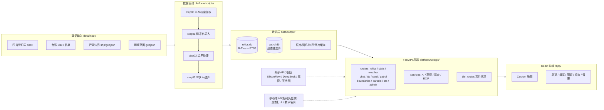

# 文物保护利用平台

一个面向不可移动文物保护与数字化管理的开源平台。把散落在 Excel、照片文件夹、PDF 档案里的文物家底整理成一张可交互的地图，再配上资源统计、图斑冲突分析、基层巡查和 AI 问答，日常保护工作需要的东西基本都在里面了。

项目名称、地图范围、县区列表这些都写在 `config.yaml` 里，换个地区部署只需要改配置和数据，不用动代码。

## 能做什么

顶部导航共五个标签：地图总览、资源概览、图斑对比、文物巡查、系统管理，都在一个页面里切换。

- **双数据口径** — 顶部可在「文保单位」与「全部文物」之间全局切换：前者只包含国、省、市、县级文保单位，后者再加入未定级不可移动文物。该口径会同步作用于地图、搜索、统计、热力图、图斑分析、AI 问答、巡查到期和路线规划；保存的巡查路线会记录创建时口径并由后端再次校验编号。
- **地图总览** — 二维地图上看全部文物点位：整市视角按保护级别着色圆点（国保红 / 省保橙 / 市保蓝 / 县保绿 / 未定级紫），放大后自动切换成"级别色圆底 + 类别剪影"的图标徽章，左下角常驻图例，级别越高名字出现得越早。行政边界用标准的市 / 县 / 镇街 / 村四级数据，按比例尺分级显隐；保护范围（红线）与建设控制地带（蓝线）可整层开关。底图默认天地图影像，另内置无需地图服务的水系、湖泊、高速和铁路专题矢量底图，离线瓦片可按需下载。点开任意一处看详情档案、照片图纸，有三维模型和普查档案的直接打开。筛选支持关键字、类别、区县、级别、年代、保存状况多维组合，统计图表点击即筛地图。
- **三级下钻** — 双击某个县进入县级视图，再双击镇街、村逐级深入，右键逐级返回，顶部面包屑随时显示当前层级；每一级都会联动筛选文物和右侧统计（区县分布图点进去变成镇街分布、再点变成村级分布）。镇街撤并改名造成的"XX镇 / XX街道"叫法不一致，前后端都做了归一匹配，不会出现点进去查不到文物的情况。
- **功能图层** — 工具栏「功能」菜单里有三个可叠加的演示模式：**时间轴**（按年代档推进的"文脉演变"动画，看各朝代文物如何在地图上铺开）、**健康度**（健康分 = 100 − 保存状况扣分 − 巡查超期扣分 − 近期天气风险扣分，规则透明可解释，地图按绿 / 黄 / 红着色）、**热力图**（文物密度热力，压在其他图层之上、文物点之下）。
- **天气联动** — 右侧面板有未来 7 日和逐小时预报，会提示雷暴、暴雨、大风对保存状况较差古建筑的影响；下雨下雪时中央地图还有很浅的天气氛围效果，不想要可以在设置里关。
- **语音讲解与数字名片** — 详情面板里有中 / 英讲解按钮，走 AI 情感语音合成（CosyVoice2），英文解说里的文物名、地名保持中文原音；音色、语速、朗读范围在设置里选，没配 Key 时自动回退浏览器本地朗读。旁边的名片按钮生成二维码，手机扫码打开免登录的文物名片页（照片 + 基础信息 + 简介 + 双语讲解），AI 语音不可用时自动改用手机本地语音。
- **资源概览** — 一屏看清家底：总量、各级保护单位构成、区县分布、年代序列、保存状况，还有一个数据质量评分，提醒你哪些字段还没补齐。
- **图斑对比** — 自然资源部门发来用地 / 耕地 / 永农 SHP（CGCS2000 高斯-克吕格或经纬度都行），直接拖进来叠到地图上，一键分析有没有压占文物保护范围、建控地带或文物本体，分析对象是全部文物点而不只是文保单位。
- **文物巡查** — 左侧规划、右侧地图。按保存状况自动排巡查频率（状况越差查得越勤），到期提醒；用一句话让 AI 帮你规划路线（"从县文旅局出发巡查XX附近保存较差的 5 处文物"），也可以在地图上点选组线；配了高德 Key 走真实驾车路径。保存生成二维码，巡查员手机扫码唤起高德 App 全程导航、拍照打卡；照片的 EXIF 定位会和文物坐标自动比对核验是否到场，AI 还能对比历史照片评估保存状况，最后一键出巡查报告。
- **AI 问答** — 基于全量台账的大模型问答，面板可以随手拖到不挡地图的地方。"哪个乡镇的古建筑最多"这类统计题直接问；"泗河上的桥类文物有哪些"这类空间题也行（后端会沿河湖矢量做距离检索）；"有哪些牌坊类文物，包括附属文物"也能答上来（附属文物单独建了列并进了全文索引）。回答里的数量、县区、文物名都是可点击链接，点了直接在地图上筛选或定位。
- **系统管理** — 运维不用碰命令行：可视化跑数据管线（实时日志 + 完整落盘留档 + 跑完自动热重载）、在线配置 API Key 与模型（保存即生效）、下载离线地图瓦片和行政边界、一键清数（口令确认，标准边界自动从仓库种子恢复）。「设置」标签管本机偏好：天气效果、双击下钻、图表联动飞行、语音音色 / 语速 / 朗读范围（可试听）。

另有深墨蓝 / 经典亮白 / 藏青政务 / 青碧 / 胭脂红 / 琉璃六套主题配色（设置面板切换）。没配 AI Key 时问答和评估自动降级成规则模式，没配高德 Key 时路线用直线连接，没配天地图 Key 时底图回退高德，都不影响启动和演示。

## 快速开始

**Windows：** 双击 `start.bat` 就行。它会自己装依赖、构建前端、起服务、打开浏览器。改过前端代码用 `start.bat build`，前端开发热更新用 `start.bat dev`。

**macOS / Linux：**

```bash
# 1) 后端依赖(建议 Python 3.10+)
python3 -m venv .venv
.venv/bin/pip install -r platform/webgis/requirements.txt

# 2) 配置
cp config.example.yaml config.yaml   # 按需修改项目名、地图中心、范围等

# 3) 演示数据(手头没有真实数据时)
.venv/bin/python platform/tools/generate_demo_data.py
.venv/bin/python platform/scripts/run_pipeline.py

# 4) 前端构建
cd platform/webgis-react && npm install && npm run build && cd ../..

# 5) 启动
.venv/bin/python platform/webgis/serve.py
# 浏览器打开 http://127.0.0.1:8000
```

跑起来之后，管线、API Key、离线地图这些都可以去页面上的「系统管理」操作，不用再回终端。

## 接入自己的数据

**推荐路线：四普登记表 docx 直接进管线。** 把登记表按乡镇分文件夹放进 `data/input/00_docs/`，在「系统管理 → 数据管线」点"运行全部管线"：

1. **档案提取（step00）**：调用大模型（SiliconFlow，Key 在系统管理里配）把 docx 逐份提取成结构化 Markdown 档案。支持断点续传——中断后重跑只处理缺失和损坏的文件，进度账本在 `data/output/logs/step00_progress.json`。配了 DeepSeek 官方 Key 还可勾选**双通道提取**：SiliconFlow 从前往后、DeepSeek 从后往前同时跑，各自断点续传、认领锁防重复，速度约翻倍
2. **数据导入（step01）**：解析 Markdown 档案——简介全文、度分秒坐标、附属文物、权属 / 调查人等全部字段；照片和图纸按清单顺序直接从 docx 内嵌图片中抽出。同时做两项外部数据融合：**两线范围**（`data/*两线*/` 下的测绘 GeoJSON 按名称+县区挂接到文物）与**市县保级别拆分**（登记表的"市级和县级"合并勾选项，按市保名单 + 县保名录 + 简介公布语句拆成市保 / 县保）
3. **边界处理（step02）** 与 **数据库构建（step03）**：行政边界统一转 WGS-84 GeoJSON；建 `relics.db`（R-Tree 空间索引 + FTS5 全文搜索）

各类数据的放置位置：

| 数据 | 放置位置 | 说明 |
| --- | --- | --- |
| 普查登记表 | `data/input/00_docs/{乡镇}/*.docx` | 文件夹名作为乡镇字段;文件名以档案编号开头 |
| Markdown 档案 | `data/input/01_relics/markdown/{乡镇}/*.md` | step00 的产物,也可直接放入已有档案 |
| 全市未清洗 Markdown | `data/济宁市未清洗数据/{县区}/*.md` | 可同时含在级与未定级；step01 仅追加未定级记录，现有文保单位保持原台账 |
| 文物台账(旧格式) | `data/input/01_relics/*.xlsx` | 兼容保留,无 Markdown 档案时启用 |
| 照片 / 图纸 | `data/input/02_media/photos/{编号}/`、`drawings/{编号}/` | 无源 docx 时的媒体来源 |
| 两线范围矢量 | `data/{任意含"两线"的目录}/*.geojson` | WGS-84,properties 含 name/county/rangeType(0=保护范围 1=建控地带) |
| 市/县保名单 | `data/*名单*.xls`、`data/*县级*名录*.xlsx` | step01 用于拆分"市级和县级"合并级别 |
| 行政边界 | `data/input/03_boundaries/` | Shapefile 或 GeoJSON；也可在系统管理里在线下载 |
| 标准四级边界 | `boundary/standard/` | ArcGIS 标准市/县/镇街/村界；启动时按 manifest 自动恢复并同步离线导航 |
| 普查档案 PDF | `data/input/06_archive_docs/{编号}/{sanpu,sipu}/*.pdf` | 三普 / 四普 PDF |
| 三维模型 | `data/Get3D/{编号}/tileset.json` | 3D Tiles |

重建只影响主数据库 `relics.db`；巡查记录存在独立的 `patrol.db` 里，怎么重建都不会丢。管线每次运行的完整日志都会落盘到 `data/output/logs/`（系统管理页发起的任务在 `logs/admin_tasks/`）。

## 系统是怎么搭的

整套系统走**单机一体化**路线：一个 Python 进程同时提供 API 和前端静态托管，数据全部落在本地 SQLite 与文件系统，不依赖任何外部数据库或中间件。这么选是因为基层文保单位通常只有一台普通办公电脑，要求就是"双击即用、断网可用、数据不出本机"。外部依赖（大模型、高德路线、天地图底图）全部是可选增强：配了 Key 体验更好，不配就自动降级为规则引擎、直线连接、备用底图，不影响启动和核心功能。



### 技术选型

| 层次 | 选型 | 理由 |
| --- | --- | --- |
| 数据管线 | Python 脚本 + OpenAI 兼容 API | 四步流水线可单独重跑;LLM 把非结构化 docx 转为结构化档案 |
| 存储 | SQLite(WAL + R-Tree + FTS5) | 零运维单文件库;空间索引与中文全文检索开箱即用 |
| 后端 | FastAPI + Uvicorn | 异步支撑瓦片代理与 SSE 流式问答;自动 API 文档 |
| 前端 | React 18 + TypeScript + Vite 5 | 组件化拆分功能页;构建产物直接由后端托管 |
| 地图 | Cesium 1.125 | 同一引擎覆盖 2.5D 地图与 3D Tiles 模型;瓦片走后端代理 |
| 状态管理 | Zustand 5 | 轻量切片式 store,筛选/图层/下钻/巡查各自独立 |
| 图表 | ECharts 5 | 统计图点击联动地图筛选与下钻 |
| 3D 模型 | three + react-three-fiber + 3d-tiles-renderer | 普查三维模型(3D Tiles)独立查看页 |

### 数据管线

管线在 `platform/scripts/`，由 `run_pipeline.py` 编排，支持 `--only / --from / --to / --skip / --dry-run`，每次运行的产物校验结果写入 `data/output/logs/pipeline_manifest.json`。设计原则是**每步幂等、可单独重跑、重建不碰巡查库**。

- **step00 档案提取**：直接用 `zipfile` + `ElementTree` 解析 OOXML 取正文（不依赖 python-docx），交给大模型按四普模板提取成 Markdown。产物先写 `.tmp` 再原子替换，已有文件做完整性校验，双通道并行时用 `.claim` 认领锁防重复；检测到 `step00.stop` 哨兵文件会优雅退出，重跑即续传。
- **step01 标准化导入**：`md_archive.py` 全字段解析（含度分秒坐标转十进制、附属文物表、照片图纸清单），照片图纸按清单顺序从源 docx 内嵌图片中抽出；无 Markdown 时回退旧版 xlsx 台账。输出 `relics_full.json`、两份 GeoJSON、照片图纸索引。
- **step02 边界处理**：常规数据由 `pyshp` 读 Shapefile，支持高斯-克吕格反算与 GCJ-02 纠偏，统一输出 WGS-84。随包标准边界以 `boundary/standard/manifest.json` 为权威版本，市 / 县 / 镇街按 EPSG:4326 直读，村界按其 Albers 投影 `.prj` 重投影并过滤邻市要素。
- **step03 SQLite 建库**：全量重建 `relics.db`（幂等），启用 WAL。主表 `relics` + R-Tree 空间索引（桥接表映射字符串 id）+ FTS5 全文索引（trigram 分词，对中文子串友好，简介和附属文物都在索引里）+ 照片 / 图纸 / 两线面资源表。

### 后端

入口 `serve.py` 读取 `config.yaml` 启动 `uvicorn main:app`（默认 `0.0.0.0:8000`）。启动生命周期：加载配置（`${ENV}` 占位自动展开）→ 功能探测（数据目录为空则自动关闭对应功能）→ 数据装载（优先 DB 模式，库缺失时回退 JSON 内存模式，保证演示数据也能跑）→ 标准边界按 manifest 版本与 SHA-256 校验恢复 → 初始化 AI / 巡查 / 问答服务与配置热更新回调（系统管理页保存 Key 即生效，无需重启）。

路由统一挂在 `/api` 下：

| 路由 | 职责 | 代表端点 |
| --- | --- | --- |
| `relics.py` | 文物查询主链路 | `GET /api/relics/by-bbox`(R-Tree 视口查询)、`/search`(FTS5)、`/{code}` 详情及照片/图纸/两线/档案 |
| `stats.py` | 统计聚合 | `GET /api/stats`、`/stats/dashboard` |
| `weather.py` | 天气预报 | Open-Meteo 代理,前端天气面板与地图氛围共用 |
| `chat.py` | AI 问答 | `POST /api/chat`(SSE 流式),含河湖沿线空间检索与附属文物检索 |
| `tts.py` | 语音讲解 | `POST/GET /api/tts/narrate`(CosyVoice2 合成,英文先由文本模型转写、专名保留中文),文本与音频双层 LRU 缓存 |
| `card.py` | 数字名片 | `GET /api/card/{code}` 名片数据、`/qr.png` 二维码(免登录) |
| `patrol.py` | 巡查 PC + 移动端 | `/api/patrol/plan`(AI 规划);移动端 `GET /m/r/{token}`、扫码打卡 |
| `parcels.py` | 图斑对比 | SHP 导入(自动识别投影)、冲突分析(STRtree 空间索引) |
| `boundaries.py` | 边界管理 | 行政区树、在线下载、导出、清理 |
| `crs.py` | 坐标系服务 | `/api/crs/transform`(-geojson) |
| `admin.py` | 系统管理 | 管线运行/日志/停止、API 配置保存、模型列表拉取、清数 |

几个值得一提的实现：

- **瓦片代理**（`tile_routes.py`）：`GET /tiles/{provider}/{z}/{x}/{y}` 代理天地图 / 高德 / ArcGIS / OSM，内存 LRU + 磁盘永久缓存（同一区域只消耗一次天地图配额）、上游并发限流、同瓦片去重飞行、Key 动态注入与子域轮转，另有离线整片下载和分源缓存清理。
- **巡查独立库**：路线（含扫码 token）和打卡记录存独立的 `patrol.db`，与主库解耦，管线怎么重建都不丢巡查历史。
- **移动端适配**：巡查打卡页和数字名片页都是免登录 H5，二维码地址优先取 `server.public_base_url`，留空自动探测局域网 IP；名片页语音在手机浏览器的手势限制下走 GET 音频直链，AI 不可用时回退手机本地语音合成。

### 前端

前端在 `platform/webgis-react/`，Vite 构建 `base="/app/"`，产物由后端托管：`index.html` 每次协商不缓存，带哈希的 assets 长缓存，更新前端只需重新 build。

- **路由与页面**：HashRouter 单页应用。地图总览（`MapView` + 工具栏 / 筛选 / 详情 / 下钻面包屑 / 时间轴 / AI 问答浮窗）、资源概览、图斑对比、巡查、系统管理，另有独立的 3D 模型页、PDF 档案页、手机名片页。Cesium 实例常驻挂载，切标签只是隐藏，避免重建。
- **状态管理**：Zustand 按域切片——`relicsStore`（全量数据与索引）、`filterStore`（多维筛选并映射后端参数）、`uiStore`（主题 / 图层开关 / 本机设置，localStorage 持久化）、`drillStore`（三级下钻）、`timelineStore`、`weatherStore`、`patrolStore`、`parcelStore` 等。
- **地图渲染**：远视角按级别着色圆点，近视角切"级别色圆底 + 类别剪影"徽章（运行时 canvas 合成）；下钻高亮用抬升发光描边 + 半透明墙体 + 域外压暗；热力图画在 canvas 上再作为贴图叠加，文物点关闭深度测试永远置顶。
- **行政区划归一**：`utils/township.ts` 处理镇街改名（"XX镇 / XX街道"）、异体字（傅/付、邱/丘）、数字前缀等命名差异，边界匹配、筛选、统计合并都走同一套词干比对。

### AI 能力

所有 LLM 调用统一走 OpenAI 兼容接口，模型在系统管理页全局选择，每处都有无 Key 降级路径：

| 能力 | 位置 | 模型通道 | 无 Key 降级 |
| --- | --- | --- | --- |
| 档案提取(step00) | `scripts/step00_convert_docs.py` | SiliconFlow / DeepSeek 双通道 | 报错退出该步,不伪造数据 |
| AI 问答 | `routers/chat.py` | SiliconFlow 文本模型 | 返回未配置提示 |
| 语音讲解 | `routers/tts.py` | CosyVoice2 语音 + 文本模型翻译 | 回退浏览器/手机本地 TTS |
| 巡查意图解析 | `ai_service.parse_patrol_intent_*` | SiliconFlow 文本模型 | 正则规则解析 |
| 照片对比评估 | `ai_service.assess_patrol_photo` | 视觉模型(默认 Qwen2.5-VL-72B) | 规则兜底,标记待复评 |

问答走"结构化台账注入"路线：后端按问题检索相关文物拼入上下文（统计题给全量分县表格，空间题沿河湖矢量算距离取沿线文物，"附属"类问题额外检索附属文物列），回答中的数量、县区、文物名渲染为可点击链接，点击直接驱动地图。

### 部署与认证

单机单进程，8000 端口同时服务 API、前端与瓦片。`config.yaml` 一个文件管所有配置（模板 `config.example.yaml`），敏感 Key 支持 `${环境变量}` 占位。`server.enable_auth` 开启后走签名会话登录；移动端打卡链接和名片页始终免登录。要跨网使用（手机不在同一局域网），把 `server.public_base_url` 填成公网可达地址即可，配合内网穿透或云服务器部署。

## 项目结构

```
platform/
├─ scripts/            # 数据管线(4 步)
│  ├─ step00_convert_docs.py       # 四普登记表 docx → Markdown 档案(LLM 提取,断点续传)
│  ├─ step01_import_relics.py      # Markdown 档案/台账导入 + docx 照片图纸抽取
│  ├─ step02_prepare_boundaries.py # 行政边界转 GeoJSON
│  ├─ step03_build_db.py           # SQLite 建库(R-Tree 空间索引 + FTS5 全文搜索)
│  ├─ md_archive.py                # Markdown 档案解析库(坐标/边界/清单/内嵌图片)
│  └─ run_pipeline.py              # 编排入口,支持 --only / --dry-run
├─ tools/
│  └─ generate_demo_data.py        # 演示数据生成器
├─ webgis/             # FastAPI 后端
│  ├─ main.py                      # 入口
│  ├─ routers/                     # relics / stats / chat / tts / card / patrol / parcels / admin ...
│  ├─ services/                    # AI / 高德路线 / 巡查 / EXIF 定位
│  ├─ tile_routes.py               # 瓦片代理与缓存(天地图/高德/ArcGIS/OSM + 离线下载)
│  └─ templates/mobile_route.html  # 巡查移动端 H5
└─ webgis-react/       # React + Cesium 前端(Vite 构建,后端在 /app/ 托管)
boundary/standard/     # 随包标准四级行政边界(manifest 版本管理)
tests/                 # pytest 测试
```

## 配置要点

```yaml
api:
  siliconflow:
    key: "sk-..."             # AI 问答 / 档案提取通道A / 巡查规划 / 照片评估 / 语音讲解
    default_model: "..."      # 全局 AI 模型(系统管理页可视化选择)
    extract_concurrency: 2    # step00 档案提取并发数(1-8)
  deepseek:
    key: "sk-..."             # DeepSeek 官方 API,档案提取通道B(可选,双通道并行)
    default_model: "deepseek-chat"
    extract_concurrency: 2
  amap:
    web_key: "..."            # 高德 Web 服务 key,驾车路线规划+出发地地理编码(可选)
  tianditu:
    key: "..."                # 天地图服务端 key,官方在线底图(推荐)
  weather:
    base_url: "https://api.open-meteo.com/v1/forecast"
    key: ""                   # Open-Meteo 公共接口免 Key,商用订阅可填写
server:
  public_base_url: ""         # 手机扫码用的对外地址,留空自动探测局域网 IP
```

这几个 Key 都可以启动后在「系统管理 → API 配置」里直接填（按平台分组：Key / API 地址 / 模型三行一组），保存即生效。天地图瓦片由后端代理并永久缓存到本地，同一区域只消耗一次配额；也可以在系统管理里把常用层级整片下载下来离线用。

## 测试

```bash
.venv/bin/python -m pytest tests/ -q
```

覆盖瓦片参数解析与越界防护、登录认证与会话签名、管线产物校验与编排、数据口径与未定级导入、DB 行到前端格式映射、天气服务、标准边界恢复等关键链路。

## 开源协议

本项目采用[木兰宽松许可证, 第2版](http://license.coscl.org.cn/MulanPSL2)（MulanPSL-2.0）开源，完整条款见 [LICENSE](LICENSE)。简单说：可以自由使用、修改、分发（商用也行），保留版权声明即可，软件按"现状"提供、不带担保。
